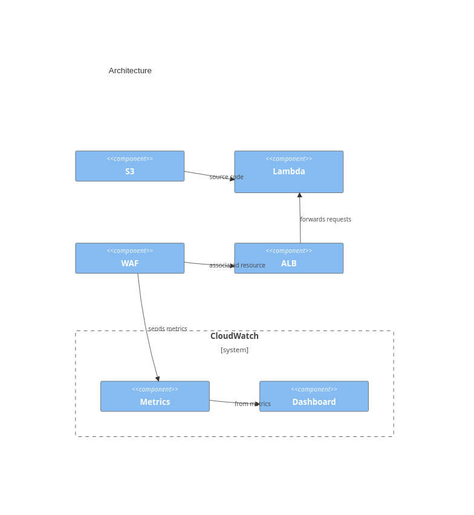

# Concept

This repo demonstrates a working AWS WAF Dashboard which shows the top 5 blocking rules.

[AWS WAF Dashboard (screenshot)](dashboard-screenshot.png)

In order to reach this result, the WebACL shall be configured with metrics generation enabled.

The dashboard is configured with the following query expression:

```sql
SELECT AVG(BlockedRequests)
       FROM SCHEMA("AWS/WAFV2", LabelName,LabelNamespace,Region,WebACL)
       GROUP BY LabelNamespace, LabelName
       ORDER BY AVG()
       DESC LIMIT 5
```

# Architecture



# Deployment

All AWS resources of the experiment are managed by CloudFormation. The CloudFormation resources shall be invoked by an IAM user, see the `iam` directory.

Then an S3 bucket shall be created. See `s3` directory.

After that the Lambda function shall be compiled, uploaded to S3 bucket and the respective Lambda function resource shall be created, see `lambda` directory.

Finally, the ALB, Lambda, WAF, and the dashboard is created, see `waf-app` directory .
